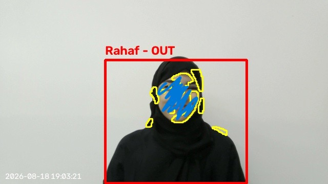
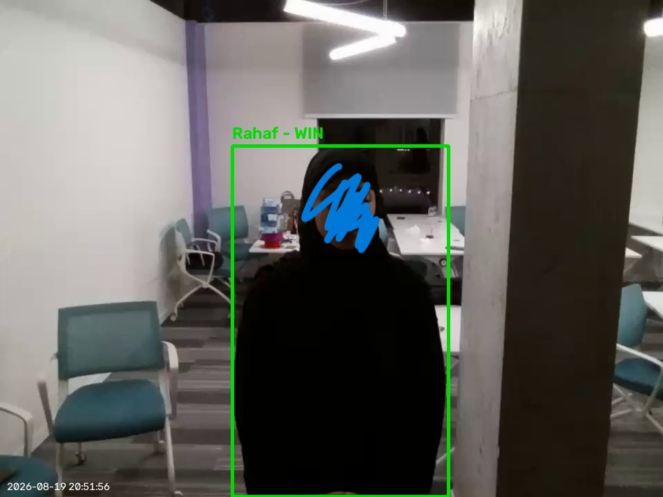

# 🦑 Squid Game Drone

An AI referee for **Red Light, Green Light** — built with a real DJI Tello drone, a camera, face recognition, and computer vision. The drone recognizes every player, monitors them continuously, and eliminates anyone who moves during a "red light" round — with photographic proof of every call.




*(Real frames captured by the running system — not staged renders. The yellow contour marks the exact pixels the motion detector flagged; the green box is a live face-recognition match, not a manually typed label.)*

---

## The problem

A human referee can't watch four people at once, can't prove who moved, and gets it wrong under pressure. Squid-Game-style elimination games need an impartial, second-by-second judge — and a drone can hover, rotate, and record evidence no person can match.

**What this project does:**
- Detects and tracks every player in frame (YOLOv8n + ByteTrack).
- Identifies each player by face (InsightFace `buffalo_l`) so results carry real names, not IDs.
- Classifies motion per player, per frame, during red-light windows.
- Controls a real Tello drone: takeoff, 180° rotation to face/away from players, safety-monitored landing.
- Auto-saves an evidence photo for every elimination and win.
- Tracks a persistent leaderboard across sessions.

---

## How it works

```
Camera (Tello / webcam)
        │
        ▼
YOLOv8n detection + ByteTrack ID  ──▶  per-player bounding boxes
        │
        ├──▶ InsightFace embedding  ──▶  compare vs players.json  ──▶  player name
        │
        └──▶ per-box frame-diff motion score  ──▶  moving / still  ──▶  eliminate / survive
        │
        ▼
Game state machine (Lobby → Green → Red → repeat) → Winner + Leaderboard
```

The drone itself never runs any inference — all detection/recognition runs on the connected computer's CPU, using pretrained models (no custom training) to keep everything real-time.

---

## Model & results

No custom model was trained. Two pretrained backbones do the heavy lifting:

| Component | Model | Role |
|---|---|---|
| Person detection + tracking | **YOLOv8n** (COCO-pretrained) + ByteTrack | Locate and ID every player each frame |
| Face recognition | **InsightFace `buffalo_l`** (pretrained) | Match a live face to a registered player |
| Motion classification | Hand-tuned frame-differencing rule (per-player ROI) | Decide "moved" vs "still" during red light |

Motion classification is the one part of the pipeline that needed tuning, since it's a rule (not a learned model). It ships with its own CLI evaluation pipeline (`collect` → `label` → `evaluate` → `sweep`) so results are reproducible on your own webcam.

**Latest local evaluation run** (295 labeled frames: a stationary session + an actively-moving session):

| Metric | Value |
|---|---|
| Accuracy | **88.1%** |
| Precision | **93.7%** |
| Recall | **81.4%** |
| F1-score | **87.1%** |

Confusion matrix:

| | Predicted: still | Predicted: moving |
|---|---|---|
| **Actual: still**  | 142 (TN) | 8 (FP) |
| **Actual: moving** | 27 (FN) | 118 (TP) |

**Where it works:** clear, deliberate movement is caught reliably — 93.7% precision means very few false eliminations.
**Where it fails, honestly:** 27 moving frames were missed (recall 81.4%), mostly subtle motion right at the detection threshold rather than full misses. Reproduce or improve on these numbers yourself:

```bash
python main.py collect --session still_1 --duration 30 --webcam
python main.py collect --session moving_1 --duration 30 --webcam
python main.py label --session still_1 --label still
python main.py label --session moving_1 --label moving
python main.py sweep      # finds the best motion-area threshold for your camera
python main.py evaluate   # prints accuracy / precision / recall / F1 / confusion matrix
```

---

## Repo structure

```
.
├── main.py                  # CLI entry point — every command below runs through this
├── requirements.txt
├── yolov8n.pt                # pretrained YOLOv8n weights (~6.5 MB, included directly)
├── players.json.example      # template for the face-registry file (real file is gitignored)
├── leaderboard.json.example  # template for the leaderboard file (real file is gitignored)
├── docs/
│   └── screenshots/           # real evidence frames used in this README
├── djitellopy/                # DJI Tello SDK wrapper (MIT-licensed, vendored)
└── squidgame/                  # project source
    ├── config.py                 # every tunable setting in one place
    ├── camera_utils.py            # webcam capture helpers
    ├── person_tracking.py          # YOLOv8n + ByteTrack wrapper, player registry
    ├── face_id.py                   # InsightFace wrapper, face registration/matching
    ├── motion_baseline.py            # collect / label / evaluate / sweep pipeline
    ├── game_engine.py                 # lobby, round state machine, drone control loop
    ├── safety.py                       # pre-flight checks, battery/connection monitoring
    ├── voice.py                         # spoken "green light / red light" announcements
    ├── dashboard.py                      # end-of-game results screen
    ├── hat_overlay.py / hat_selection.py  # optional AR hat cosmetic layer
    ├── traffic_light.py                    # green/red light visual state
    ├── leaderboard.py                       # persistent win tracking
    └── storage.py                            # JSON read/write helpers
```

> **Note on weights & data:** `yolov8n.pt` is ~6.5 MB, well under GitHub's 100 MB limit, so it's committed directly — no external link needed. `players.json` and `leaderboard.json` contain **real biometric face data** from testing and are intentionally **gitignored**; `.example` versions are provided instead. Generate your own with the `register` command below.

---

## Setup

Requires **Python 3.10–3.12** (InsightFace/onnxruntime wheels can lag behind the newest Python releases).

```bash
git clone <this-repo-url>
cd game_try2
pip install -r requirements.txt
```

`av` (PyAV) is required for decoding the Tello's video stream even if you only ever use `--webcam` mode.

---

## Usage

### 1. Register a player (builds `players.json`)
```bash
python main.py register --name "Player Name" --webcam
```
Capture ~15 face samples by pressing **Space** at different angles.

```bash
python main.py players       # list everyone registered
```

### 2. Play — safe webcam test (no drone required)
```bash
python main.py play --webcam --no-flight
```

### 3. Play — real Tello drone
```bash
python main.py check          # pre-flight battery/temperature report, no takeoff
python main.py fly-test       # isolated takeoff → hover → land, no game logic
python main.py play           # full game: lobby → rounds → winner → auto-land
```

### Windows shortcuts
Double-click any of:
- `START_GAME_WEBCAM.bat` — full-feature webcam test
- `START_GAME_WEBCAM_FAST.bat` — Face ID in lobby only, smoother live camera
- `START_GAME_WEBCAM_ULTRAFAST_NO_NAMES.bat` — max speed, no face ID at all

### Other useful commands
```bash
python main.py leaderboard              # show all-time win counts
python main.py registry-test --webcam   # test player detection/registry alone
python main.py hats-test --webcam       # preview the optional AR hat overlay
```

### Controls during a game
| Key | Action |
|---|---|
| `Q` | Safe exit (lands the drone if flying) |
| `S` | Manually start the round once players are visible in lobby |
| Hat selection | Mouse click or number keys |

---

## V3: Ultra-Fast Mode

The latest version streamlines the live-camera loop for lower latency and adds a clearer end-of-game flow.

**Recommended Windows launch:**
Double-click `START_GAME_WEBCAM_FAST.bat`, equivalent to:
```bash
py main.py play --webcam --no-flight --no-evidence
```
This mode still runs Face ID in the lobby, so final results carry player names — but Face ID does **not** run inside the active game loop, keeping the live camera smoother.

**Ultra-fast mode without player names:**
```bash
py main.py play --webcam --no-flight --no-face-id --no-evidence
```
or double-click `START_GAME_WEBCAM_ULTRAFAST_NO_NAMES.bat`.

**V3 game flow:**
- The camera keeps only the newest webcam frame.
- YOLO tracking runs on a background worker and never blocks the display loop.
- Tracking uses a 256-pixel inference size for lower CPU latency.
- RED LIGHT starts with a full-screen eye warning for 3 seconds.
- Motion detection starts after the eye screen, using the live camera.
- A single elimination does not end the game.
- A single winner does not end the game.
- The game ends only when every starting player is either WIN or OUT.
- Winners are ranked by finish order: 1st, 2nd, 3rd, and so on.
- Each WIN/OUT result records the Green/Red round in which it happened.
- The final dashboard shows rank, player name, result, and round.
- A new game starts automatically after the result screen.

---

## Known limitations

- **No obstacle avoidance.** The base Tello has zero forward-facing sensors — it cannot physically detect or dodge anything in front of it. Always supervise flights directly.
- **Motion detection is a hand-tuned rule, not a learned model.** It can drift on different lighting or camera hardware; re-run the `sweep` command if accuracy drops on a new setup.
- **Face recognition degrades at range** — beyond roughly 4 m, faces reliably drop to "Unknown."
- **Video stream over the Tello's Wi-Fi can stutter,** which affects the timing precision of movement detection during real flights.
- **No GPU-trained classifier** — everything runs pretrained-model + rule-based on CPU, by design, for real-time performance on ordinary laptops.

## Roadmap / next steps

- Add players directly from an in-app interface (no separate CLI command).
- Support more than 4 simultaneous players.
- Replace the hand-tuned motion rule with a small trained pose-based classifier for lighting robustness.
- Reduce video-stream latency for tighter red-light timing.
- Add an ArUco-marker finish line so "winning" means reaching a physical point.

---

## Tech stack

Python · OpenCV · Ultralytics YOLOv8 · ByteTrack · InsightFace · djitellopy (DJI Tello SDK) · pandas · pyttsx3

## License

This project vendors [djitellopy](https://github.com/damiafuentes/DJITelloPy) under its original MIT License (see `djitellopy/`). The rest of the project is provided as-is for portfolio and educational purposes.
